<h1 align="center">Film Revenue Prediction</h1>
<p align="center"><b>Comparing six machine-learning regressors to predict a film's worldwide box-office revenue from pre-release information only, with a Flask app to try the model.</b></p>

<p align="center">
  
  
  
  
  
</p>

<p align="center">
  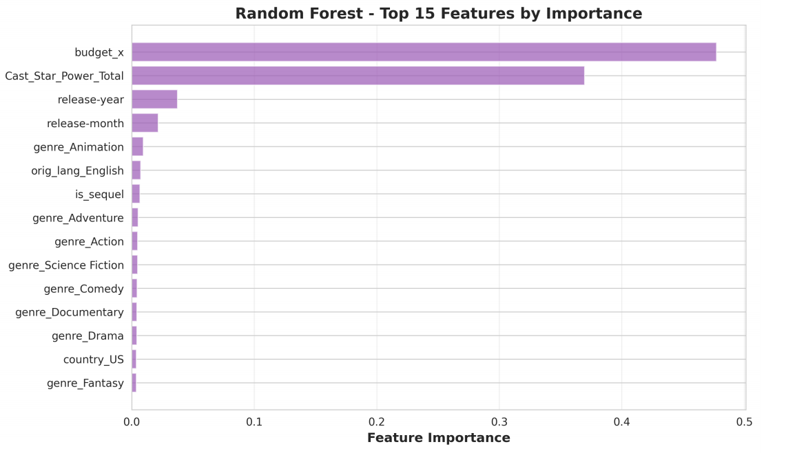
</p>
<p align="center"><i>What drives revenue (Random Forest): budget (47.7 %) and cast star power (37.0 %) dominate everything else.</i></p>

> Data Mining course project (4th year, Software Engineering), INSAT, University of Carthage, 2025/2026.
> By Mohamed Sahbi Ben Kalaia, Leith Engazzou, Yassine Dahmoul and Takoua Ayadi.
> 📄 **Full project report (in French):** [`docs/report.pdf`](docs/report.pdf)

---

## TL;DR

| | |
|---|---|
| **Question** | Can we estimate a film's worldwide revenue from data available *before* release (budget, cast, genre, ...)? |
| **Data** | 10,178 films, 12 columns (Kaggle dataset derived from IMDB) |
| **Models compared** | KNN, Decision Tree, KNN + Tree ensemble, Bagging, **Random Forest**, Gaussian Process |
| **Best model** | **Random Forest: R² = 0.751, MAE = 90.3 M$, RMSE = 138.6 M$** on a held-out 15 % test set |
| **Engineered features** | **Cast Star Power** (Bayesian-weighted actor score), **Is_Sequel** (franchise flag), release year and month, interaction terms (49 → 70 features) |
| **Leakage avoided** | The post-release `score` was deliberately dropped; only released films kept |
| **Bonus** | Gaussian Process regression gives calibrated uncertainty: 92 % coverage for a 95 % interval |
| **App** | Flask web app that serves predictions from the trained models |

---

## Dataset

A Kaggle dataset derived from IMDB: **10,178 rows × 12 columns**.

| Column | Description |
|---|---|
| `names`, `orig_title` | Commercial and original title |
| `date_x` | Release date |
| `score` | Audience/critic rating (0 to 100) |
| `genre` | One or several genres (multi-valued) |
| `overview` | Free-text synopsis |
| `crew` | Raw string mixing actor names and roles |
| `status` | Released, Post Production, ... |
| `orig_lang` | Original language code |
| `budget_x` | Production budget (USD) |
| `revenue` | Worldwide box-office revenue (USD), **the target** |
| `country` | Production country |

### What the exploration revealed

- **Revenue is extremely right-skewed:** most films earn modestly, a few blockbusters (e.g. Avatar: The Way of Water, > 2.3 billion $) stretch the tail.
- **Budget and revenue correlate strongly** (Pearson r ≈ 0.69) but with growing variance at high budgets (heteroscedasticity).
- **Cast follows a power law:** a handful of stars appear in many films, most actors appear once. This motivated a *Bayesian* average for star power instead of a plain mean.

<p align="center">
  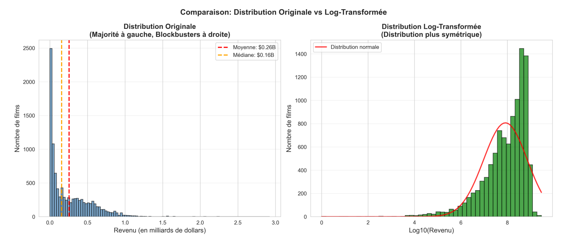
</p>

<table align="center">
  <tr>
    <td align="center">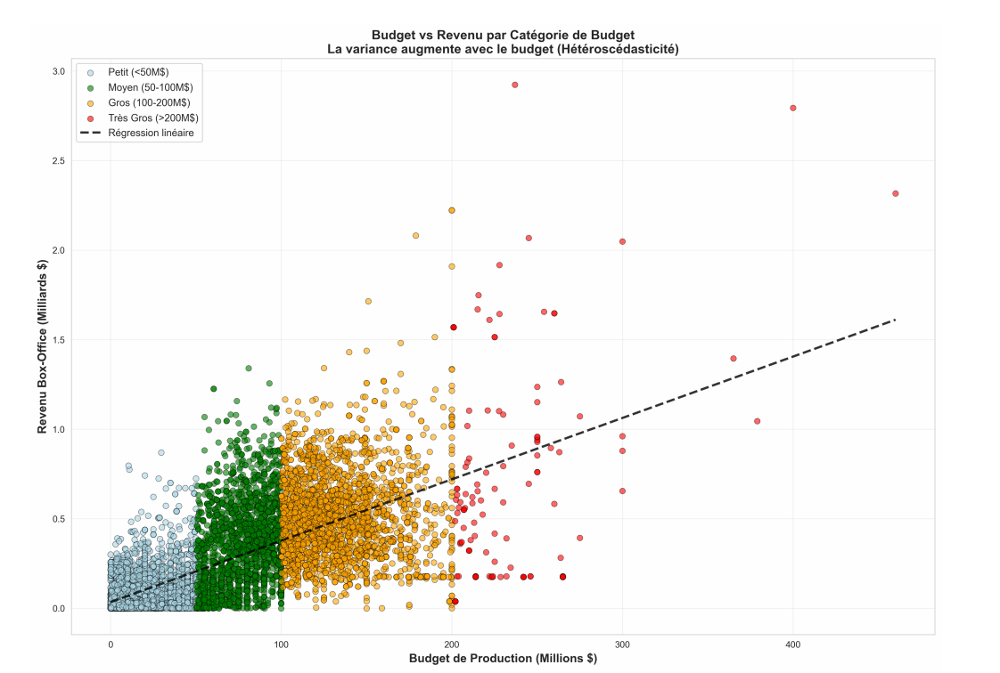<br/><b>Budget vs revenue</b></td>
    <td align="center">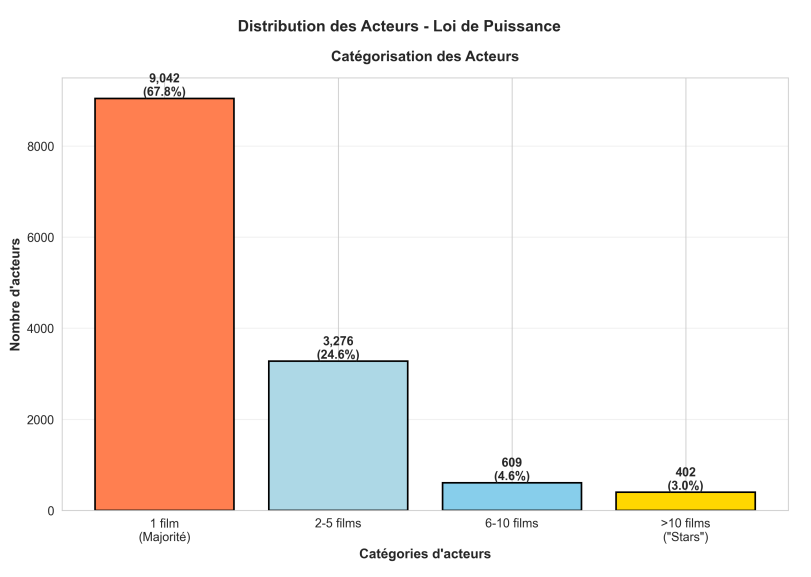<br/><b>Actor frequency (power law)</b></td>
  </tr>
</table>

---

## Data preparation and feature engineering

### Cleaning

| Step | Why |
|---|---|
| Keep only `Released` films, then drop `status` | Unreleased films have no final revenue and would be noise in the target; the column becomes constant |
| **Drop `score`** | It only exists after release, so using it would be **data leakage** and inflate results |
| Drop `overview` | Free text needs NLP, is of uneven quality, and largely duplicates genre |
| Drop original title | A unique identifier with no generalisable signal; franchise information is captured by `Is_Sequel` |
| Remove duplicates (title + release year) | Prevents over-weighting repeated films |
| **Fix wrong country codes** | An abnormal number of films carried `AU` (Australia), a default-value error in the source. A script re-assigned the true country using TMDB data; the corrected distribution is dominated by US, UK, France and India |

### Encoding (cardinality-aware one-hot)

| Variable | Strategy |
|---|---|
| **Country** | Keep the **13 most frequent** countries (93.64 % of films), group the rest as `Other` |
| **Genres** | Multi-hot over all ~19 genres (a film can be Action *and* Sci-Fi); nothing dropped |
| **Language** | Top **10** languages (97.26 % of films); rare languages become an all-zero vector |

<table align="center">
  <tr>
    <td align="center">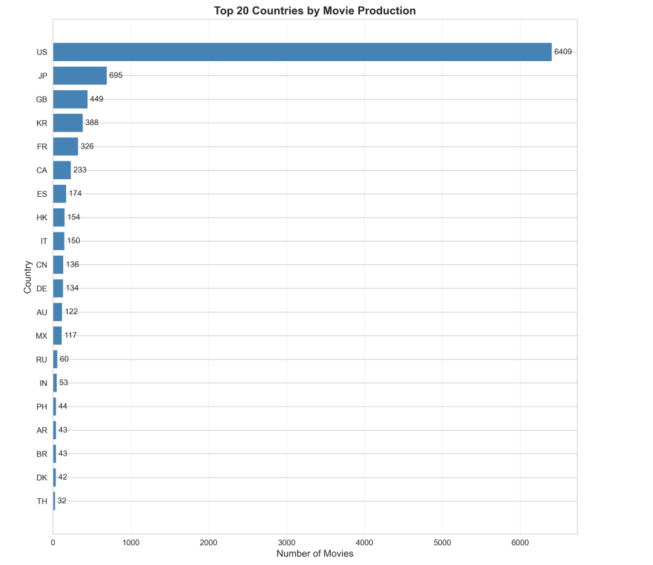<br/><b>Countries (top 20)</b></td>
    <td align="center">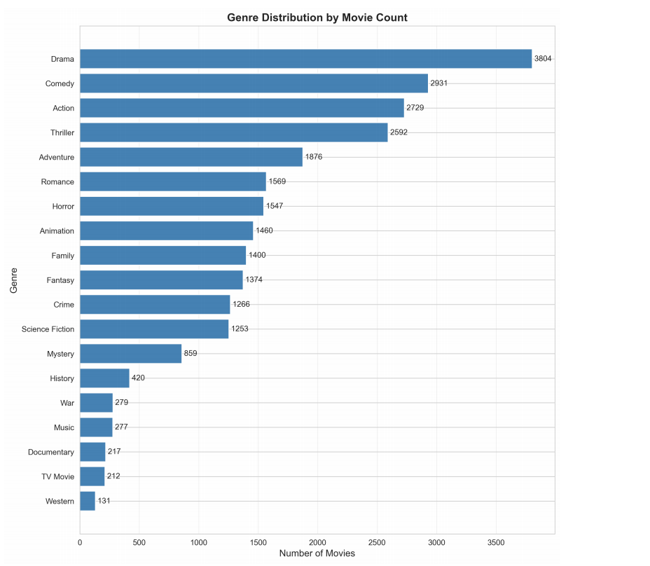<br/><b>Genres</b></td>
    <td align="center">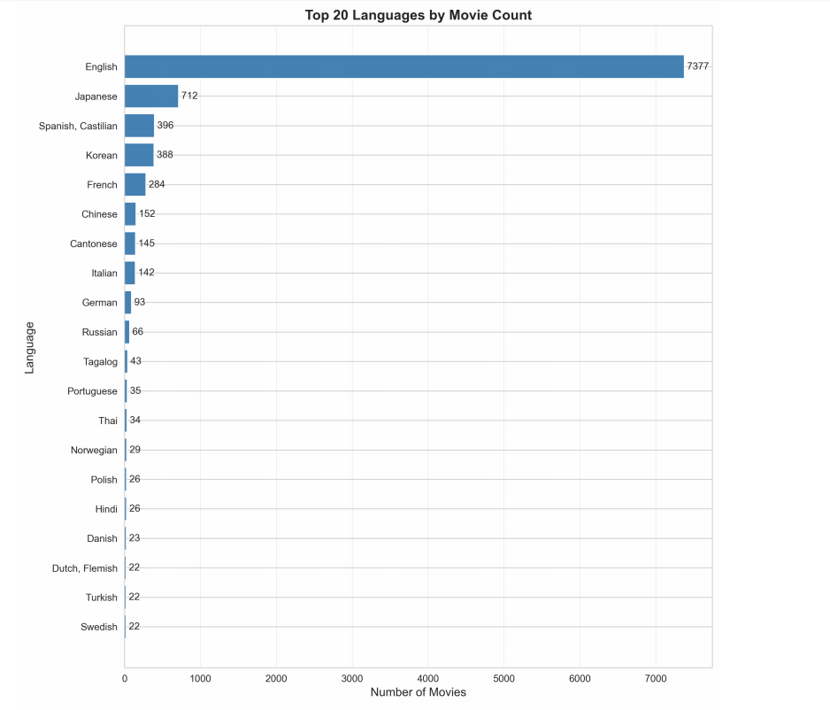<br/><b>Languages (top 20)</b></td>
  </tr>
</table>

### Engineered features

**Cast Star Power.** Plain averages overrate "one-hit wonders", so each actor's score is a **Bayesian (IMDB-style) weighted rating**:

```
WR = v/(v+m) · R  +  m/(v+m) · C
```

`R` = actor's mean film revenue, `v` = number of films, `C` = global mean over all actors, `m = 5` (isolates the ~10 % most active actors). Actors with few films are pulled toward the global mean, while established stars (e.g. ~40 films) keep essentially their own score. A film's score is a weighted sum over its **top 3 billed actors**:

```
Star_Power = 0.5·S1 + 0.3·S2 + 0.2·S3
```

Unknown actors get the global mean `C` instead of 0, so new faces are not unfairly penalised.

**Is_Sequel.** A binary flag for sequels, remakes, spin-offs and franchise films, built from title markers (II, III, 2, 3, "Part", "Chapter", "Returns", "Revenge", ...) cross-checked with franchise data from the TMDB API.

**Release_Year / Release_Month.** The date is split to capture long-term inflation and seasonality (summer blockbusters, holiday season, January/February "dump months"); the raw date is then removed.

**Interaction features.** A temporary decision tree identifies the 6 most important features; their pairwise products and squares are added, growing the feature set from **49 to 70**.

### The `preprocessing/` folder

Each step of the pipeline lives in its own numbered folder:

| Folder | Step |
|---|---|
| `1 movie split (released , not released)` | Keep released films |
| `2 remove status ,origin-name , score` / `2 remove status, ori_name` | Drop `status`, original name and `score` |
| `3 date split year , month` | Release year and month |
| `4 country fix Au` | Correct the wrong `AU` country codes |
| `5 country split` | Top countries one-hot + `Other` |
| `6 genre split` | Multi-hot genres |
| `7 language split` | Top-10 languages one-hot |
| `8 is_Sequel` | Sequel / franchise flag |
| `9 Cast_Start_Power` | Bayesian cast star power |
| `10 Merge is_Sequel & Cast_Star_Power` | Merge both engineered features into the dataset |
| `11 removing unecessary features` | Final feature selection |

---

## Models and protocol

All models share the same protocol: **85 % train / 15 % test**, **5-fold cross-validation** with `GridSearchCV` for hyperparameters (except the Gaussian Process, tuned by marginal likelihood), and the same metrics (R², RMSE, MAE). Scaling is fitted on training data only (inside a `Pipeline` for Bagging and Random Forest, so it is recomputed per CV fold).

| Model | R² train | **R² test** | RMSE test | MAE test | Notes |
|---|---:|---:|---:|---:|---|
| KNN | 1.000 | 0.685 | 152.5 M$ | 101.3 M$ | `k=10`, distance-weighted, Manhattan |
| Decision Tree | 0.764 | 0.698 | 149.3 M$ | 97.9 M$ | depth 10, 135 leaves, cost-complexity grid |
| Ensemble KNN + Tree | 0.929 | 0.721 | 143.6 M$ | 95.5 M$ | weights 0.49 / 0.51, found by a 0.05-step sweep |
| Bagging | 0.850 | 0.740 | 140.3 M$ | 93.7 M$ | 100 trees, depth 10 |
| **Random Forest** | **0.921** | **0.751** | **138.6 M$** | **90.3 M$** | 200 trees, depth 20, `max_features=0.5`; CV R² 0.7513, OOB 0.7538 |
| Gaussian Process | 0.785 | 0.675 | 155.0 M$ | 105.2 M$ | RBF + white noise, trained on 2,000 samples |

Reading the table:
- **Diversity pays off.** Ensembles beat every single model: KNN + Tree (0.721) > either alone, Bagging (0.740) > Tree, Random Forest (0.751) > Bagging.
- The **KNN's perfect train R²** is inherent to the algorithm (each point is its own neighbour), so only its test score matters.
- The **Random Forest** gap between train and test (0.17) shows real overfitting, but its CV and out-of-bag scores agree closely, so the estimate is reliable.

### Random Forest: what predicts revenue

| Feature | Importance |
|---|---:|
| Budget | 0.4773 |
| Cast star power | 0.3697 |
| Release year | 0.0374 |
| Release month | 0.0217 |
| Genre: Animation | 0.0094 |
| Language: English | 0.0075 |
| Is_Sequel | 0.0067 |
| Genre: Adventure | 0.0053 |

Predictive power is concentrated in just two factors, **investment and cast**, while timing contributes ~6 %.

<table align="center">
  <tr>
    <td align="center">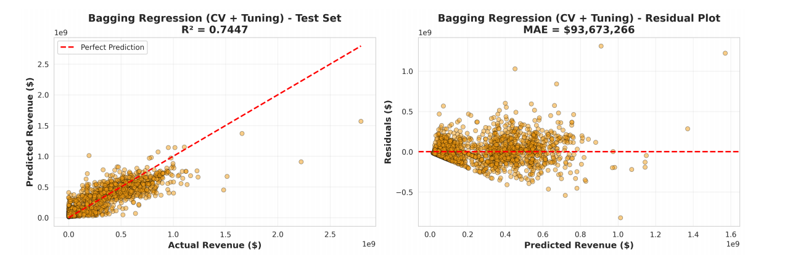<br/><b>Bagging: predictions vs actual and residuals</b></td>
    <td align="center">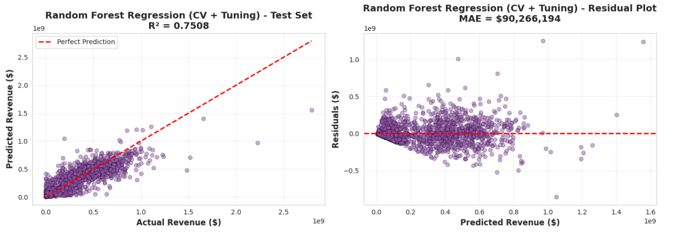<br/><b>Random Forest: predictions and residuals</b></td>
  </tr>
</table>

All models **systematically underestimate blockbusters** (> 1 billion $), and error variance grows with revenue.

<p align="center">
  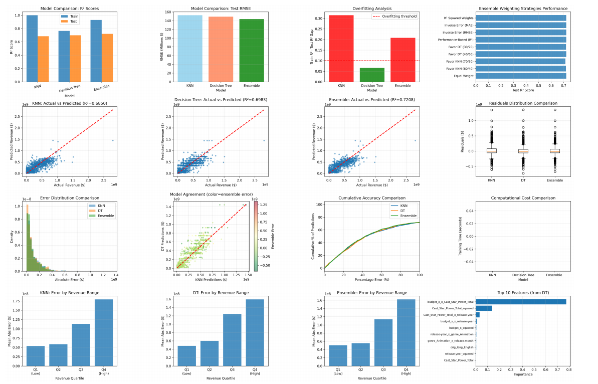
</p>

### Gaussian Process: knowing when the model is unsure

Four kernels were compared; the white-noise term is what makes the difference on noisy real revenue data.

| Kernel | R² train | R² test | MAE test |
|---|---:|---:|---:|
| RBF | 0.998 | 0.413 | 145.9 M$ |
| **RBF + WhiteKernel** | **0.785** | **0.675** | **105.2 M$** |
| Matérn (ν=1.5) | 0.999 | 0.576 | 118.9 M$ |
| Rational Quadratic | 0.999 | 0.665 | 107.1 M$ |

Its value is the **uncertainty estimate**: 95 % intervals cover the truth 92 % of the time (well calibrated, slightly overconfident), the predicted standard deviation correlates with the actual error (0.31), and the most uncertain 10 % of predictions (std > 150 M$) are mostly very-high-budget films. That lets an analyst flag unreliable predictions for human review.

<p align="center">
  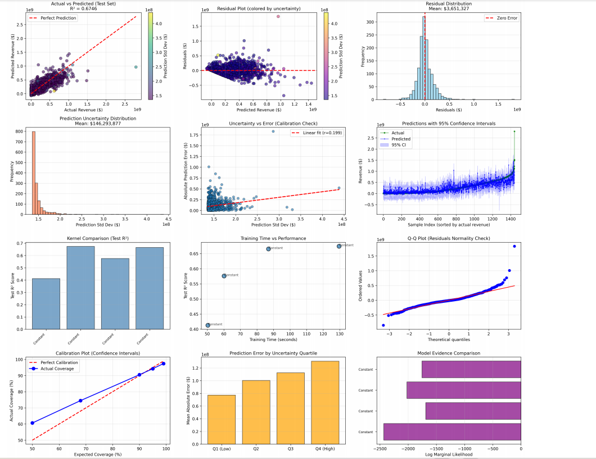
</p>

---

## The web app

A Flask application that predicts a film's revenue from features such as budget, actors and genre. It loads the saved **KNN** and **Decision Tree** regressors and the actor star-power table. The best standalone model in the study is the Random Forest (R² = 0.751), and the KNN + Decision Tree weighted ensemble reaches R² = 0.721.

## Project structure

```
film-revenue-prediction/
├── app.py                                    # Main Flask application
├── utils.py                                  # Helper functions
├── requirements.txt                          # Dependencies
├── models/                                   # Trained models and data
│   ├── decision_tree_regressor_latest.pkl
│   ├── knn_regressor_latest.pkl
│   └── actor-star-power.csv                  # Actor star-power lookup
├── static/
│   ├── css/style.css
│   └── js/script.js
├── templates/
│   ├── index.html                            # Input form
│   └── result.html                           # Prediction result
├── preprocessing/                            # Data preparation pipeline, step by step
│   ├── 1 movie split (released , not released)/
│   ├── 2 remove status ,origin-name , score/
│   ├── 2 remove status, ori_name/
│   ├── 3 date split year , month/
│   ├── 4 country fix Au/
│   ├── 5 country split/
│   ├── 6 genre split/
│   ├── 7 language split/
│   ├── 8 is_Sequel/
│   ├── 9 Cast_Start_Power/
│   ├── 10 Merge is_Sequel & Cast_Star_Power/
│   └── 11 removing unecessary features/
└── docs/
    └── report.pdf
```

## Getting started

```bash
git clone https://github.com/MedSahbiBenKalia/film-revenue-prediction.git
cd film-revenue-prediction

python -m venv venv
venv\Scripts\activate          # Windows
source venv/bin/activate       # Linux / macOS

pip install -r requirements.txt
python app.py
```

Then open the local URL that Flask prints in the terminal.

---

## Limitations

- **Blockbusters are underestimated** by every model, and error variance grows with revenue.
- **Missing signals:** no marketing budget, screen count, competition or critic data, which matter commercially.
- **Raw-scale target:** revenue is modelled in dollars, so errors are dominated by the largest films (a log transform is listed below as future work).
- **Evaluation:** a single 85/15 split of one dataset, with cross-validation inside the training set; star power is computed from revenues present in the same dataset.
- The Gaussian Process was trained on a **2,000-sample subset** because of its cubic cost.
- The Random Forest shows a train/test gap of 0.17 (R² 0.921 vs 0.751).

## Future work

- Log-transform the target (`log(1 + revenue)`) to stabilise variance and reduce outlier impact
- **Stacking** all models with a meta-model, and gradient boosting
- External features: marketing budget, number of screens, critics' reviews
- Deep learning architectures for non-linear interactions
- Deploy the Random Forest as a pre-production decision-support tool: assess a project's commercial potential, balance production vs casting budget, and flag high-risk projects using the Gaussian Process uncertainty

## Authors

Mohamed Sahbi Ben Kalaia · Leith Engazzou · Yassine Dahmoul · Takoua Ayadi
INSAT, Data Mining (4th year), 2025/2026